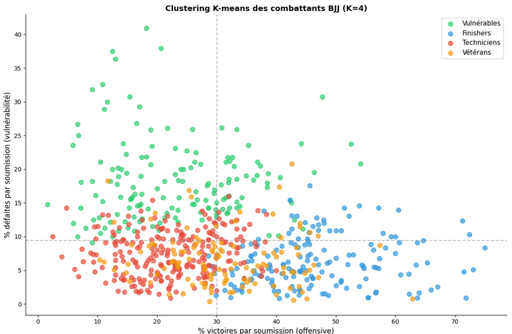
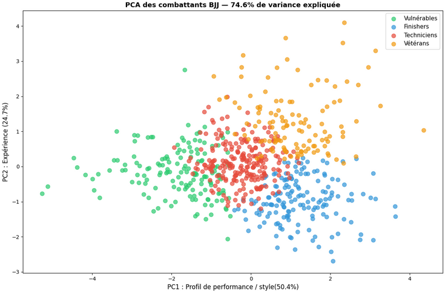

# BJJ Fighter Profiling — Clustering & Career Trajectory Analysis

Can we identify distinct fighter profiles in competitive Brazilian Jiu-Jitsu, and the strategies associated with winning? An unsupervised learning analysis of ~60,000 professional BJJ matches (2010–2025).

📄 **[Read the full report](report.pdf)** for the complete analysis, including detailed transition percentages and cluster-by-cluster breakdowns not covered below.

> Group project — built with [El Habib Touisse](https://github.com/elhabib-touisse).

## Motivation

One of us practices BJJ and started competing recently — and got submitted in under 30 seconds in his first match. That experience became the starting point for this project: rather than guessing what makes a fighter vulnerable or dominant, we let the data answer the question.

## Dataset

- **Source:** [BJJ Heroes](https://www.bjjheroes.com/), a database of professional BJJ competition results.
- **Scale:** ~60,000 individual match records, spanning 2010–2025.
- **Fields:** fighter, opponent, result (win/loss), win/loss method (submission, points, referee decision, other), competition, weight class, year.

*Data was collected for educational purposes as part of a university project and is not redistributed for commercial use.*

## Methodology

**1. Data cleaning & feature engineering**
Win/loss methods were parsed and grouped into categories (chokes, arm/shoulder locks, leg locks, triangles, points/advantages, referee decision). Per-fighter features were then built: submission win ratio, submission loss ratio, total matches, overall win ratio (and the equivalent set for points-based outcomes).

**2. Clustering (K-Means)**
Features were standardized (`StandardScaler`) and clustered with `KMeans`. The optimal number of clusters (K=4) was chosen via the elbow method, then validated against the natural quadrants visible in the raw scatter plot of offensive vs. defensive submission ratios.



This produced four fighter profiles: **Finishers** (high submission offense, low vulnerability, best overall win rate), **Veterans** (high match volume, moderate efficiency), **Technicians** (balanced, low submission vulnerability), and **Vulnerable** (weak both offensively and defensively). The same pipeline was independently re-run on points-based features, yielding an analogous four-profile typology (Efficient at points, Veterans, Vulnerable at points, Low points-oriented).

**3. Validation via PCA**
A 2-component PCA (74.6% of variance explained) confirms the cluster separation is not an artifact of the chosen features: PC1 (50.4%) captures an offensive/style axis, PC2 (24.7%) captures experience.



**4. Career trajectory analysis (custom transition matrices)**
To understand whether these profiles are stable traits or fluid states, cluster assignments were recomputed year by year for each fighter, and hand-built transition matrices (`numpy`) tracked how often fighters moved between profiles — both **cumulatively** (career-to-date features, revealing long-term identity) and **annually** (single-season features, revealing short-term shifts, e.g. a visible drop in match volume across all clusters in 2020, consistent with COVID-19).

**5. Cross-validation between typologies**
Each clustering (submission-based vs. points-based) was applied to the other's feature space, to test whether submission defense and points mastery are independent skills. They largely are — the most dominant fighters are the ones who combine both.

## Key Findings

- Submission losses account for only ~30% of all losses in competitive BJJ — points/decision outcomes dominate (~68%), confirming that modern competitive BJJ is a largely tactical, points-driven sport.
- Fighter profiles are strongly stable year-over-year in the cumulative view (up to 99.8% self-transition for Veterans) but far more volatile in the annual view — a fighter's "type" is a career-long identity, not a season-to-season label.
- Submission defense and points mastery behave as largely independent skills: the most dominant fighters combine both rather than excelling at just one.

*These are the headline results — the [full report](report.pdf) goes into much more depth: exact transition percentages between profiles, year-by-year cluster growth, and a full breakdown of how each submission profile behaves when a fight goes to points (and vice versa).*

## Tech Stack

- **Language:** Python
- **Data manipulation:** pandas, numpy
- **Machine Learning:** scikit-learn (KMeans, PCA, StandardScaler)
- **Visualization:** matplotlib, seaborn
- **Data profiling:** skrub

## Repository Contents

- `notebook.ipynb` — full analysis pipeline (data cleaning → clustering → PCA → transition matrices → cross-validation)
- `data_grappling_all.csv` — the underlying dataset
- `report.pdf` / `main.tex` — full written report with complete figure annex, produced for academic submission
- `requirements.txt` — dependencies to reproduce the analysis

## Getting Started

```bash
git clone https://github.com/<your-username>/bjj-fighter-profiling.git
cd bjj-fighter-profiling
pip install -r requirements.txt
jupyter notebook notebook.ipynb
```

## Academic Context

This project was submitted as a graded exam for a Master's-level Machine Learning course at Sorbonne Université, supervised by Rafael Pinot, including a 15-minute oral presentation and a written report.

## Authors

**Valentin Cherin** — [GitHub](https://github.com/vacheee)
**El Habib Touisse** — [GitHub](https://github.com/elhabib-touisse)
